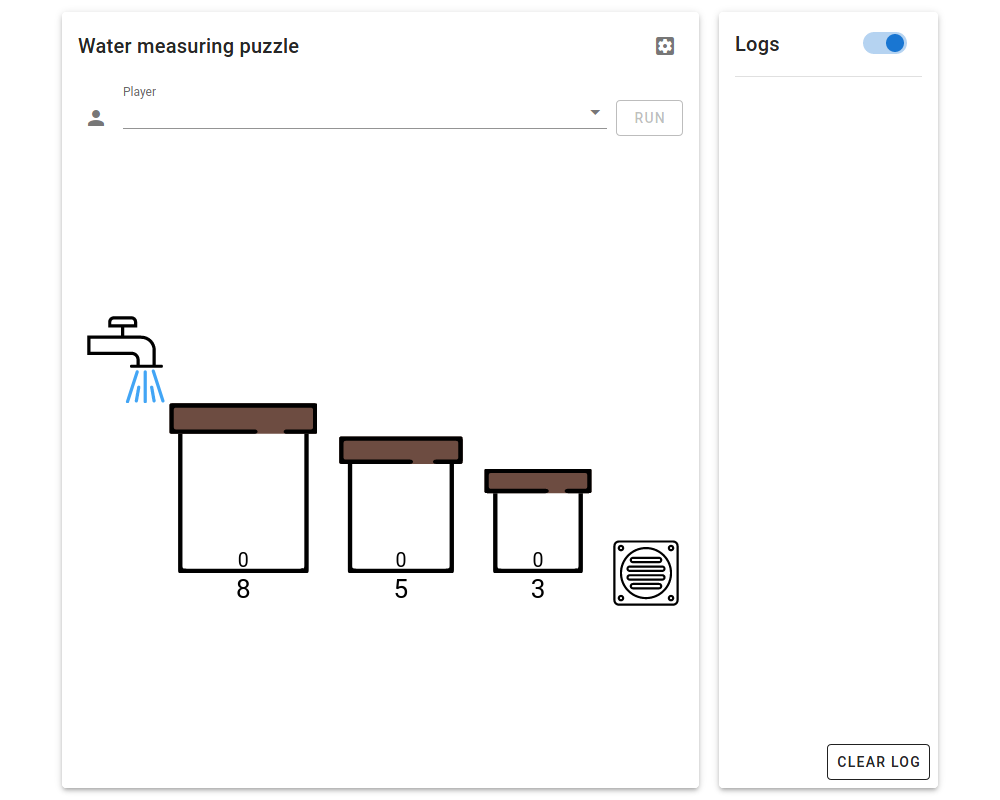

# Interface explained

This is the landing page when you launch the platform.

## Error reporting

Errors should be reported under the logs section. Check the commandline interface if an error is not captured in the logs.

<svg width="100%" viewBox="0 0 1000 800">
  <image href="../img/landing-page.png" />
  <rect x="720" y="10" width="220" height="780" stroke="teal" stroke-width="10" fill="none"/>
</svg>

## Define problem

Click  to display the problem description and configurations.

<svg width="100%" viewBox="0 0 1000 800">
  <image href="../img/landing-page.png" />
  <rect x="640" y="20" width="50" height="50" stroke="teal" stroke-width="10" fill="none"/>
</svg>

### Bucket size

<svg width="100%" viewBox="0 0 1000 800">
  <image href="../img/define-problem.png" />
  <rect x="40" y="190" width="920" height="110" stroke="teal" stroke-width="10" fill="none"/>
</svg>

This line shows the number of buckets and the size of each bucket. The text of the smaller font indicate the index of the bucket.

- To remove a bucket, click  next to the bucket size.

- To add a bucket, enter the size of the bucket in the text field and press <kbd>return</kbd> to create the bucket. 

### Initial fill

<svg width="100%" viewBox="0 0 1000 800">
  <image href="../img/define-problem.png" />
  <rect x="40" y="310" width="920" height="110" stroke="teal" stroke-width="10" fill="none"/>
</svg>

This line defines the initial fill of a bucket at the beginning of the problem. To edit the initial fill of a bucket, click the  next to the initial fill. The order of the initial fills follows the order of the bucket sizes. The text of the smaller font indicate the index of the bucket.

### Water source

<svg width="100%" viewBox="0 0 1000 800">
  <image href="../img/define-problem.png" />
  <rect x="40" y="430" width="920" height="50" stroke="teal" stroke-width="10" fill="none"/>
</svg>

The water source provides unlimited water. The water source refers to the availability of the water tap. It can be toggled by clicking on the  or . 

### Water sink

<svg width="100%" viewBox="0 0 1000 800">
  <image href="../img/define-problem.png" />
  <rect x="40" y="480" width="920" height="50" stroke="teal" stroke-width="10" fill="none"/>
</svg>

The water sink allows unlimited pouring away of water. The water sink refers to the availability of the drain. It can be toggled by clicking on the  or .

### Target

<svg width="100%" viewBox="0 0 1000 800">
  <image href="../img/define-problem.png" />
  <rect x="40" y="525" width="920" height="110" stroke="teal" stroke-width="10" fill="none"/>
</svg>

This line shows the amount of water to be achieved in one of the buckets. To change the value, enter the new value in the text field and press <kbd>return</kbd> to update. 

## Choose player

<svg width="100%" viewBox="0 0 1000 800">
  <image href="../img/select-player.png" />
  <rect x="75" y="75" width="620" height="80" stroke="teal" stroke-width="10" fill="none"/>
</svg>

Use the dropdown menu to select the player to be used to solve the problem. Click on the icon to the left of the dropdown menu to show the player profile.

<svg width="100%" viewBox="0 0 1000 800">
  <image href="../img/player-details.png" />
</svg>

If any of the information in the player profile does not display correctly, check the `player.py` to make sure it follows the defined format in [`Player` class](instructions.html#player-class).

## Run player to solve problem

<svg width="100%" viewBox="0 0 1000 800">
  <image href="../img/select-player.png" />
  <rect x="75" y="75" width="620" height="80" stroke="teal" stroke-width="10" fill="none"/>
</svg>

Click the run button to the right of the dropdown menu to use the selected player to solve the problem.

## Inspect solution

When the player finished the execution and found the solution, the path should be shown at the bottom of the graphic.

<svg width="100%" viewBox="0 0 1000 800">
  <image href="../img/after-run.png" />
  <rect x="75" y="650" width="610" height="130" stroke="teal" stroke-width="10" fill="none"/>
</svg>

The path shows the fills of the buckets starting from the beginning to the end. Clicking on the step or using the slider will allow the graphic to display the situation of the selected step. For example,

<svg width="100%" viewBox="0 0 1000 800">
  <image href="../img/show-states.png" />
</svg>

The numbers outside the buckets show the size of the buckets, whereas the numbers inside the buckets show the fill of the buckets.

## Show search tree

Click  to show the search tree.

<svg width="100%" viewBox="0 0 1000 800">
  <image href="../img/after-run.png" />
  <rect x="640" y="710" width="50" height="50" stroke="teal" stroke-width="10" fill="none"/>
</svg>

<svg width="100%" viewBox="0 0 1000 800">
  <image href="../img/search-tree.png" />
</svg>

## Tweak search tree

The configurations of the search tree can be shown by clicking .

<svg width="100%" viewBox="0 0 1000 800">
  <image href="../img/search-tree-settings.png" />
  <rect x="908" y="48" width="50" height="50" stroke="teal" stroke-width="10" fill="none"/>
</svg>

Font sizes and dimensions related to the search tree can be tweaked accordingly.