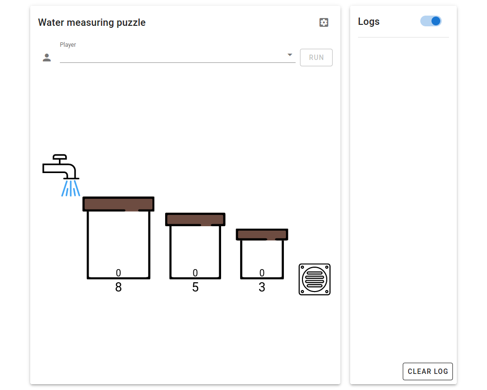

# Test environment setup

## Create Anaconda environment (optional)

You may or may not want to create a separate environment in Anaconda. You can also use the `base` environment. 

Follow the instructions to create a new Anaconda environment. 

1. Launch Anaconda navigator.
2. Go to `Environments` (on the left) > `Create` (on the bottom).
3. Give your environment a name.
4. Select Python 3.x.
5. Click `Create`.

<video controls width="100%">
  <source src="../tutorials/A1.1.create.environment.mp4" type="video/mp4" />
</video>

## Launch terminal within the environment

1. Launch Anaconda navigator.
2. Go to `Environments` (on the left).
3. Click on the environment you will be using.
4. Click on  next to the environment after it is loaded.
5. Choose `Open Terminal`.

<video controls width="100%">
  <source width="100%" src="../tutorials/A1.2.Launch.Terminal.mp4" type="video/mp4" />
</video>

## Launch terminal within the environment (alternative)

1. Launch a terminal.
2. Run `conda activate your-environment-name`. Replace `your-environment-name` with the name of the environment you created.

### Installation of packages

1. You need to install two packages: `fastapi` and `uvicorn`.

2. In the terminal with your environment activated, issue the following command

    `conda install -c conda-forge fastapi uvicorn`

<video controls width="100%">
  <source width="100%" src="../tutorials/A1.3.Install.Packages.mp4" type="video/mp4" />
</video>

## Clone or download

1. If you are familiar with `git`, clone the repository [https://github.com/ricwtk/water-measuring-puzzle](https://github.com/ricwtk/water-measuring-puzzle); else, download the repository and unzip the file.

2. There is no specific location you need to put this folder at. 

3. You should have the following folder struture. Do not change the structure within the folder.

    <svg width="100%" viewBox="0 -20 1000 340">
      <svg class="mdi-folder" x="0" y="0" width="55" height="55" viewBox="0 0 24 24">
        <path fill="black" d="M10,4H4C2.89,4 2,4.89 2,6V18A2,2 0 0,0 4,20H20A2,2 0 0,0 22,18V8C22,6.89 21.1,6 20,6H12L10,4Z"/>
      </svg>
      <text dominant-baseline="text-before-edge" x="70" y="5" stroke="transparent" fill="black" style="font-size:28px">water-measuring-puzzle</text>
      <svg class="mdi-folder" x="50" y="80" width="55" height="55" viewBox="0 0 24 24">
        <path fill="black" d="M10,4H4C2.89,4 2,4.89 2,6V18A2,2 0 0,0 4,20H20A2,2 0 0,0 22,18V8C22,6.89 21.1,6 20,6H12L10,4Z"/>
      </svg>
      <text dominant-baseline="text-before-edge" x="120" y="85" stroke="transparent" fill="black" style="font-size:28px">frontend</text>
      <svg class="mdi-folder" x="50" y="160" width="55" height="55" viewBox="0 0 24 24">
        <path fill="black" d="M10,4H4C2.89,4 2,4.89 2,6V18A2,2 0 0,0 4,20H20A2,2 0 0,0 22,18V8C22,6.89 21.1,6 20,6H12L10,4Z"/>
      </svg>
      <text dominant-baseline="text-before-edge" x="120" y="165" stroke="transparent" fill="black" style="font-size:28px">players</text>
      <svg class="mdi-language-python" x="50" y="240" width="55" height="55" viewBox="0 0 24 24">
        <path fill="black" d="M19.14,7.5A2.86,2.86 0 0,1 22,10.36V14.14A2.86,2.86 0 0,1 19.14,17H12C12,17.39 12.32,17.96 12.71,17.96H17V19.64A2.86,2.86 0 0,1 14.14,22.5H9.86A2.86,2.86 0 0,1 7,19.64V15.89C7,14.31 8.28,13.04 9.86,13.04H15.11C16.69,13.04 17.96,11.76 17.96,10.18V7.5H19.14M14.86,19.29C14.46,19.29 14.14,19.59 14.14,20.18C14.14,20.77 14.46,20.89 14.86,20.89A0.71,0.71 0 0,0 15.57,20.18C15.57,19.59 15.25,19.29 14.86,19.29M4.86,17.5C3.28,17.5 2,16.22 2,14.64V10.86C2,9.28 3.28,8 4.86,8H12C12,7.61 11.68,7.04 11.29,7.04H7V5.36C7,3.78 8.28,2.5 9.86,2.5H14.14C15.72,2.5 17,3.78 17,5.36V9.11C17,10.69 15.72,11.96 14.14,11.96H8.89C7.31,11.96 6.04,13.24 6.04,14.82V17.5H4.86M9.14,5.71C9.54,5.71 9.86,5.41 9.86,4.82C9.86,4.23 9.54,4.11 9.14,4.11C8.75,4.11 8.43,4.23 8.43,4.82C8.43,5.41 8.75,5.71 9.14,5.71Z"/>
      </svg>
      <text dominant-baseline="text-before-edge" x="120" y="245" stroke="transparent" fill="black" style="font-size:28px">server.py</text>
      <path d="M 25 55 v 52 h 20 m -20 0 v 80 h 20 m -20 0 v 80 h 20 m -20 0" stroke="black" fill="none" stroke-width="5"/>
    </svg>

4. Files or folders that are not presented in the above structure can be deleted if you wish to. They are meant to create this documentation/instruction.

## Run the application

1. [Launch a terminal within the environment](#launch-terminal-within-the-environment) you will be using.
2. Change directory `cd` to the [folder that you have expanded or cloned the repository to](#clone-or-download).
3. Execute the command `uvicorn server:app --reload`.
4. Head to your browser and go to `http://127.0.0.1:8000` or `http://localhost:8000/`. If your terminal output shows a different port, use that port instead.

